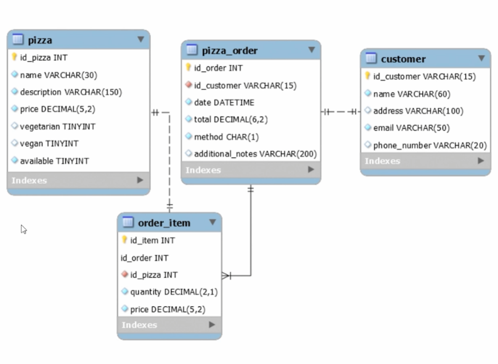

# Curso de Spring JPA: Proyecto - Manejo Pizzeria

## DB: MySQL

### Modelo entidad relacion de la DB:

### Observaciones:

* el atributo Method, se refiere a si la piden para llevar o comer en el local, mirar el servicio 'OrderService'
* Un OrdenItem solo puede estar relacionado con una Pizza
* Una Orden puede tener muchos Items
* Una Orden solo puede tener un Cliente
* No es necesario la relacion de Pizza hacia OrdenItem, para saber que pizza aparece en que orden
* No es necesario la relacion Customer con Orden, para saber las ordenes de un customer
* ___Esto ultimo se puede saber por medio de consultas___

## Swagger:

* http://server:port/context-path/swagger-ui.html
* http://server:port/context-path/v3/api-docs
* swagger-ui custom path (springdoc.swagger-ui.path=/swagger-ui.html)
* http://localhost:8080/swagger-ui.html

## Paginacion de los resultados:

* Usando ListPagingAndSortingRepository que permite en los servicios usar Page y Pageable para controlar la cantidad de
  paginas y elementso en estas

## Projection:

### este paquete permite estandarizar los queries nativos que voy a ejecutar por medio de la creacion de interfaces.

## Aplicar el Store Procedure en mysql workbench copiando de 'sp_take_random....' y ejecutando